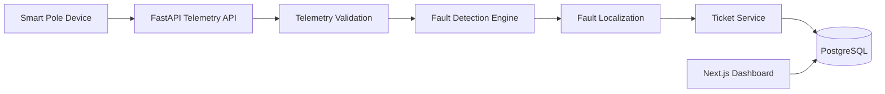

# ARCHITECTURE.md

# GridGuard AI - System Architecture

## Overview

GridGuard AI is an AI-assisted smart grid monitoring platform that detects, localizes and manages power outages using real-time telemetry generated by smart pole devices.

The system models an electricity distribution network consisting of:

```
Feeder
    │
    ├── Distribution Transformer (DT)
    │         │
    │         ├── Pole
    │         ├── Pole
    │         ├── Pole
    │         └── Pole
```

Each pole periodically sends telemetry to the backend. The backend validates telemetry, updates the network state, detects outages, localizes faults, and automatically creates maintenance tickets.

---

# High Level Architecture



---

# Data Flow

## 1. Telemetry Generation

Each smart pole device periodically transmits

- Device ID
- Pole Code
- Event
- Sequence Number
- Timestamp
- RSSI
- Battery Voltage
- Firmware Version

Example

```json
{
    "device_id":"DEV-000023",
    "pole_id":"P00023",
    "event":"power_lost",
    "energized":false,
    "seq":52
}
```

---

## 2. Telemetry Validation

Incoming telemetry is validated before processing.

Validation includes

- Duplicate sequence detection
- Out-of-order packet rejection
- Unknown device rejection
- Invalid timestamp rejection

Only valid packets are stored.

---

# Duplicate Handling

Duplicate packets are detected using

```
(device_id, sequence_number)
```

If the same sequence number already exists for a device, the packet is discarded.

Complexity

```
O(1)
```

with indexed lookup.

---

# Out-of-order Messages

Each device maintains an increasing sequence number.

If

```
incoming_sequence
<
latest_sequence
```

the packet is ignored.

This prevents stale telemetry from creating false outages.

---

# Clock Skew

Device timestamps are stored but sequence numbers are considered the primary ordering mechanism.

This prevents incorrect ordering caused by device clock drift.

---

# Burst Handling

During feeder failures hundreds of telemetry packets may arrive almost simultaneously.

GridGuard processes each packet independently while preventing duplicate ticket creation through open-ticket checks.

---

# Storage Model

Database entities

```
Feeder

↓

Transformer

↓

Pole

↓

Telemetry

↓

Ticket
```

Relationships

```
Feeder

1 ---- N

Transformer

1 ---- N

Pole

1 ---- N

Telemetry

Pole

1 ---- N

Ticket
```

---

# Network Representation

The electrical network is represented as a hierarchical tree

```
Feeder

↓

Transformer

↓

Pole
```

Each pole belongs to exactly one transformer.

Each transformer belongs to exactly one feeder.

This representation simplifies

- outage propagation
- localization
- repair simulation

while keeping database queries efficient.

---

# Fault Localization Algorithm

Localization begins when a

```
power_lost
```

telemetry event is received.

Algorithm

1. Identify affected pole.

2. Retrieve all poles connected to the same transformer.

3. Count energized and de-energized poles.

4. Determine outage scope.

Cases

### Span Fault

Only downstream poles lose power.

Fault localized between two consecutive poles.

### Transformer Fault

All poles under one transformer lose power.

Fault assigned to transformer.

### Feeder Fault

All transformers under a feeder lose power.

Fault assigned to feeder.

Confidence is increased when all expected poles exhibit the same behavior.

---

# Complexity

Pole lookup

```
O(1)
```

Transformer lookup

```
O(n)
```

where

```
n
=
number of poles
```

Feeder lookup

```
O(m)
```

where

```
m
=
number of transformers
```

---

# Missing Pole Ordering

Some real-world transformers may not have complete pole ordering.

Current assumption

Poles are ordered using

```
seq_on_line
```

stored in the database.

Future improvement

Use GIS coordinates and graph traversal instead of relying on sequence numbers.

---

# Noise Handling

The simulator supports multiple noise scenarios.

Examples

- Device reboot
- Heartbeat
- Duplicate packets
- Delayed telemetry

Noise packets do not generate fault tickets.

Scheduled outages are also excluded from fault detection.

---

# Ticket Lifecycle

```
Detected

↓

Acknowledged

↓

Crew Assigned

↓

Resolved

↓

Verified

↓

Closed
```

Tickets automatically close after receiving valid power restoration telemetry.

---

# API Surface

| Method | Endpoint | Purpose |
|---------|----------|----------|
| POST | /telemetry | Receive telemetry |
| GET | /telemetry | View telemetry |
| GET | /tickets | List tickets |
| PATCH | /tickets/{id}/acknowledge | Acknowledge |
| PATCH | /tickets/{id}/assign | Assign crew |
| PATCH | /tickets/{id}/resolve | Resolve |
| POST | /faults/span | Inject span fault |
| POST | /faults/dt | Inject transformer fault |
| POST | /faults/feeder | Inject feeder fault |
| POST | /faults/noise | Inject simulator noise |
| POST | /faults/repair/span | Repair span |
| POST | /faults/repair/dt | Repair transformer |
| POST | /faults/repair/feeder | Repair feeder |

---

# UI Design Decisions

The dashboard prioritizes operational awareness.

Operators first see

- Grid Health
- Active Faults
- Open Tickets
- Live Telemetry

Detailed telemetry is placed in dedicated pages to avoid overwhelming operators.

---

# AI Feature

GridGuard AI assists in fault localization by analyzing telemetry patterns and determining the most probable outage scope.

Rather than relying solely on individual events, the system correlates telemetry from multiple poles connected to the same transformer or feeder before creating a maintenance ticket.

If AI-assisted localization is unavailable, the application falls back to deterministic rule-based localization using the current network topology.

---

# Known Limitations

- No GIS map visualization.
- Tree topology assumes radial distribution networks.
- Localization depends on telemetry availability.
- Multiple simultaneous faults on the same feeder may reduce localization confidence.

---

# Future Improvements

- MQTT-based telemetry ingestion.
- GIS-based topology visualization.
- Graph database for network modeling.
- Predictive maintenance using machine learning.
- Streaming telemetry with Kafka.